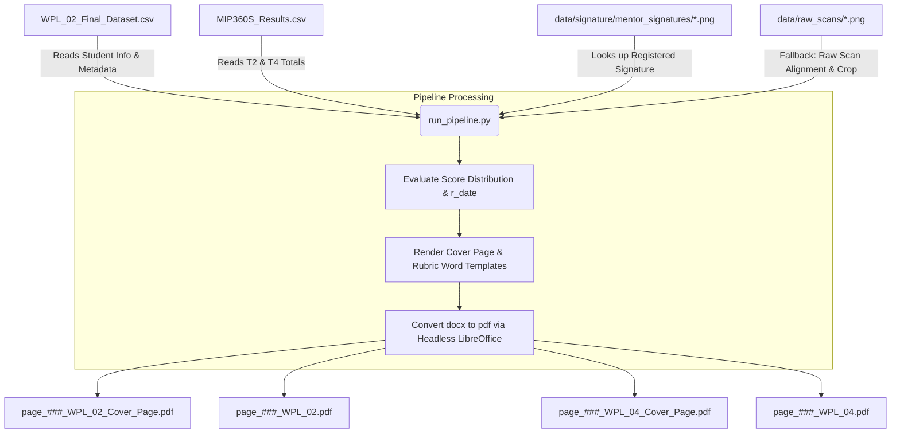

# Project Review: DocRefine-OCR

An end-to-end PDF/document refinement, score distribution, and PDF generation pipeline built on legacy `crazyOCR` to automate student workplace assessment processing.

---

## 🏗️ Architecture & Pipeline Flow

The workflow reads student data and results, dynamically distributes scores, verifies registered signatures (falling back to image processing on raw scans if needed), renders template Word files, and converts them to landscape/portrait PDFs.



---

## 📁 Project Directory Structure

Here is a breakdown of the key files and directories in the workspace:

| File / Folder Path | Type | Purpose / Description |
| :--- | :--- | :--- |
| **`run_pipeline.py`** | Script | **Main Executable.** Consolidated pipeline script that loads data, distributes scores, routes signatures, renders templates, converts to PDF, and reports metrics. |
| **`Automation_Pipeline.ipynb`** | Notebook | Jupyter wrapper referencing and documenting execution processes. |
| **`data/tables/`** | Directory | Contains `WPL_02_Final_Dataset.csv` and `totals/MIP360S_Results.csv` (student metadata and final totals). |
| **`data/raw_scans/`** | Directory | Contains raw scans (`001.png` - `090.png`) used as fallback for signature extraction. |
| **`data/signature/`** | Directory | Contains `wil_signature.jpeg` and pre-cropped mentor signatures `mentor_signatures/` (`1.png` - `91.png`). |
| **`data/templates/`** | Directory | Contains cover page and rubric templates for both `WPL_02` and `WPL_04` configurations. |
| **`data/output/docs/`** | Directory | Storage for generated output PDF documents. |
| **`logs/`** | Directory | Contains process reports, runs logs, and development changelogs. |

---

## 🔍 Resolved: Template Tag and Orientation Mismatch

1. **Cover Page Template Variables**:
   Cover page templates (`WPL_02_Cover_Page.docx` and `WPL_04_Cover_Page.docx`) have been resolved to match `student_number`, `ach_state`, `r_date`, and `final_score` (without needing dynamic `wil_signature` since the image is embedded in the template).
2. **Rubric Template Variables**:
   Rubric templates match student information, comments, and the dynamic score arrays (`Q1_1`–`Q1_7`, `Q2_1`–`Q2_7`, `Q1T`, `Q2T` for WPL_02; `X1`–`X7`, `XT` for WPL_04).
3. **Landscape / Portrait Orientation**:
   Output PDFs are generated and saved separately. Cover pages are kept in landscape orientation, and rubrics are generated in portrait orientation.

---

## 🚦 Next Steps & Action Items
1. **Run Full Batch**: Execute the pipeline script using the environment interpreter:
   ```bash
   /home/hlatsiieyhax/anaconda3/envs/crazyocr/bin/python run_pipeline.py
   ```
2. **Review Output Report**: Check the compiled report markdown file inside `logs/process_logs/` for details on successfully completed or flagged records.
